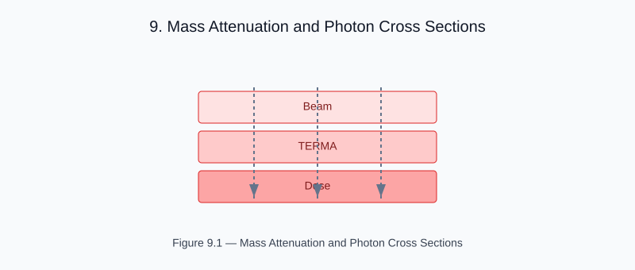

# Chapter 9 — Mass Attenuation and Photon Cross Sections

<!-- generated-figure-start -->

*Figure 9.1 — Mass Attenuation and Photon Cross Sections*
<!-- generated-figure-end -->

The helios-physics crate provides MassAttenuation models that convert
Hounsfield units to linear attenuation coefficients (μ, cm⁻¹):

```rust
use helios_physics::MassAttenuation;
use helios_solver::attenuation_map;

let mu = attenuation_map(&ct_volume, MassAttenuation::water());
```

## Water Calibration

For photon beams in the MV range, the linear attenuation coefficient is
derived from the HU value and the beam energy:

```text
μ(HU) = μ_water · (1 + HU/1000)   for soft tissue
μ(HU) = μ_cortical_bone            for HU > 700
```

Typical values at 6 MV:
| Material | HU | μ (cm⁻¹) |
|---|---|---|
| Air | −1000 | ~0 |
| Water | 0 | 0.060 |
| Cortical bone | 800 | 0.108 |

## Further Reading

- [Example: Tomotherapy Workflow](examples/tomotherapy_workflow.md)
- [Terma and Energy Deposition](dose_terma.md)
