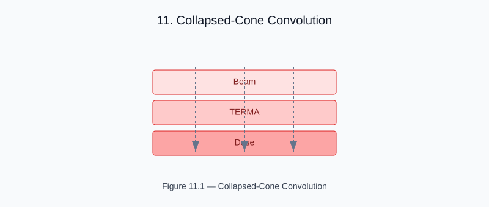

# Chapter 11 — Collapsed-Cone Convolution

<!-- generated-figure-start -->

*Figure 11.1 — Collapsed-Cone Convolution*
<!-- generated-figure-end -->

The CollapsedCone solver in helios-simulation converts terma to dose
by convolving with a poly-energetic pencil-beam kernel:

```rust
use helios_simulation::{CollapsedCone, accumulate_delivered_dose_anisotropic};

let dose = accumulate_delivered_dose_anisotropic(&terma, &mu, &CollapsedCone::default());
```

## Algorithm

1. **Collapse** the pencil-beam point-spread function onto N_cone discrete
   angular cones (default: 48 cones)
2. **Ray-march** each cone direction through the attenuation map
3. **Accumulate** dose from exponential transport along each ray

```text
D(r) = Σ_k  T(r) · A_k · exp(−μ_bar · d_k(r))
```

## Beam Hardening

For poly-energetic beams, each spectral component is transported
with its own μ and kernel weight, then summed:

```rust
let spectrum = vec![SpectralComponent { energy_mev: 6.0, weight: 1.0 }];
```

## Performance

The anisotropic variant uses moirai for parallel cone-direction dispatch.

## Further Reading

- [Example: Tomotherapy Workflow](examples/tomotherapy_workflow.md)
- [Beam Hardening and Poly-Energetic Spectra](dose_spectra.md)
