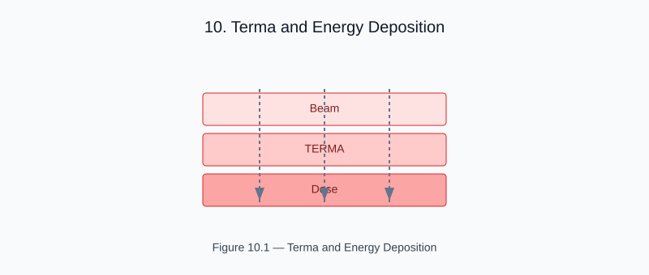

# Chapter 10 — Terma and Energy Deposition

<!-- generated-figure-start -->

*Figure 10.1 — Terma and Energy Deposition*
<!-- generated-figure-end -->

**Terma** (Total Energy Released per unit MAss) is the primary quantity
from which dose is convolved:

```text
T(r) = Φ(r) · (μ_en/ρ)(r)
```

where Φ is the fluence and μ_en/ρ is the energy-absorption coefficient.

```text
use helios_simulation::simulate_helical_delivery;

let terma = simulate_helical_delivery(&delivery, &mu_volume, &spectrum);
```

## Helical Delivery Terma

For a TomoTherapy beam rotating helically, the terma accumulates from
all gantry angles and couch positions. The implementation in
helios-simulation sums fan-beam contributions at each delivery step.

## Physical Units

- Terma: Gy = J/kg
- Fluence Φ: photons/m²
- μ_en/ρ: m²/kg

## Further Reading

- [Example: Tomotherapy Workflow](examples/tomotherapy_workflow.md)
- [Collapsed-Cone Convolution](dose_collapsed_cone.md)
