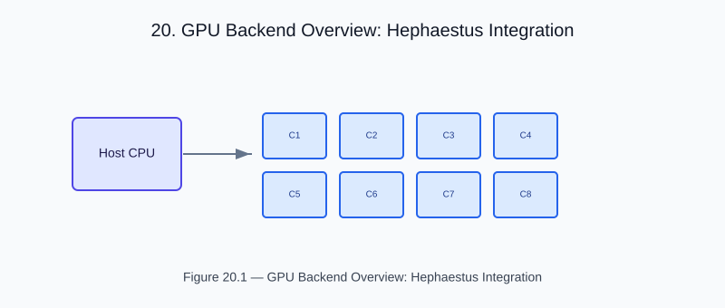

# Chapter 20 — GPU Backend Overview: Hephaestus Integration

<!-- generated-figure-start -->

*Figure 20.1 — GPU Backend Overview: Hephaestus Integration*
<!-- generated-figure-end -->

`helios-gpu` implements Helios-specific kernels over the Atlas
`hephaestus_core::ComputeDevice` seam and the `hephaestus-wgpu` backend.
Domain and physics crates do not depend on GPU infrastructure.

## Public operations

- `default_device` acquires a `WgpuDevice`.
- `GpuAttenuationMapper` maps CT values on the device.
- `GpuProjector` performs resident-volume projection.
- `beam_transmission_into` evaluates transmission into caller-provided output
  storage.

GPU buffers use `f32`, matching the wgpu compute boundary. The crate validates
each GPU operation differentially against its CPU reference; a device failure is
reported as `HephaestusError` rather than silently selecting another backend.

## Example

Run the live-device example on a host with a compatible adapter:

```text
cargo run -p helios-gpu --example gpu_attenuation_projection
```

## Further reading

- [GPU-Accelerated Dose Kernels](gpu_dose.md)
- [GPU Attenuation and Projection Example](examples/gpu_attenuation_projection.md)
