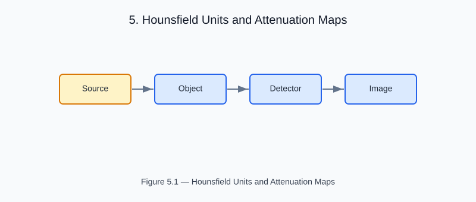

# Chapter 5 — Hounsfield Units and Attenuation Maps

<!-- generated-figure-start -->

*Figure 5.1 — Hounsfield Units and Attenuation Maps*
<!-- generated-figure-end -->

CT scanners measure X-ray attenuation and express it in Hounsfield Units (HU):

```text
HU = 1000 × (μ − μ_water) / μ_water
```

| Material | Typical HU range |
|---|---|
| Air | −1000 |
| Lung | −800 to −400 |
| Water | 0 |
| Soft tissue | +20 to +80 |
| Cortical bone | +700 to +3000 |

Helios uses HounsfieldUnit (a validated newtype from helios-core) to ensure
only valid HU values enter the attenuation pipeline.

## Further Reading

- [Physics Domain Types and Safety Boundaries](foundations.md)
- [Mass Attenuation and Photon Cross Sections](dose_attenuation.md)
- [Example: Tomotherapy Workflow](examples/tomotherapy_workflow.md)
