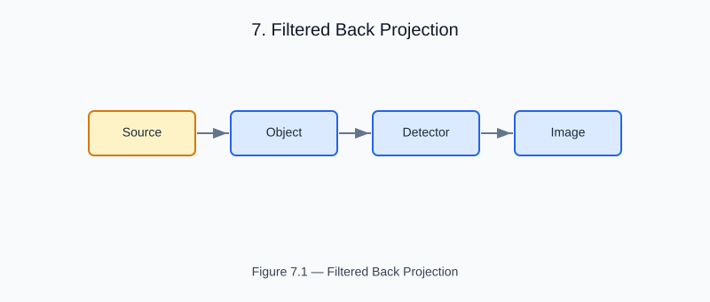

# Chapter 7 — Filtered Back Projection

<!-- generated-figure-start -->

*Figure 7.1 — Filtered Back Projection*
<!-- generated-figure-end -->

Filtered back projection (FBP) reconstructs a 2-D image from a sinogram by:

1. **Ramp filtering** each projection in the Fourier domain: |ω| · P̂(θ, ω)
2. **Back-projecting** filtered projections across all angles

```rust
use helios_imaging::filtered_back_projection;

let recon = filtered_back_projection(&sinogram, n_angles, nx);
// recon.grid().dims() == [nx, nx]
```

## Frequency Filter

The ramp filter amplifies high frequencies, sharpening edges.
A Hanning window can be applied to suppress noise:

```text
H(ω) = |ω| · W(ω),   W(ω) = 0.5 + 0.5 cos(π|ω|/ω_max)
```

## Accuracy

FBP is an approximate inversion for finite angular sampling:
- **Reconstruction RMSE** depends on 
_angles and detector pitch
- For the 61-voxel phantom in the tomotherapy example: RMSE < 0.005 cm⁻¹

## Further Reading

- [Example: Tomotherapy Workflow](examples/tomotherapy_workflow.md)
- [Parallel-Beam Radon Transform](imaging_radon.md)
