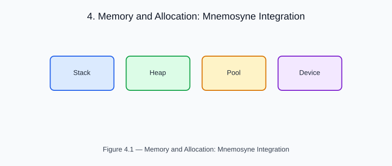

# Chapter 4 — Memory and Allocation: Mnemosyne Integration

<!-- generated-figure-start -->

*Figure 4.1 — Memory and Allocation: Mnemosyne Integration*
<!-- generated-figure-end -->

Helios allocates every dense physics array through the leto array substrate:
`Volume<T>` owns a C-contiguous `leto::Array3<T>` (`crates/helios-domain/src/volume.rs`),
and sinograms, dose grids, and terma volumes are built once and then read
through borrowed slices.

## Arena Allocation — planned, not yet integrated

No Helios crate depends on mnemosyne today: `mnemosyne-core` is declared in the
workspace dependency SSOT (`Cargo.toml`) but no member consumes it, and the
source tree contains no `mnemosyne` import. Arena-backed placement for the
large intermediate buffers is tracked work, not current behaviour; the
placement contract Helios does consume is Themis
(`PlacementHint`/`MemoryTier` in `crates/helios-gpu/src/{attenuation,projection,transmission}.rs`),
which hints GPU-resident buffers.

## Layout Policy

| Data | Layout | Rationale |
|---|---|---|
| Volumetric arrays | C-contiguous (row-major) | Cache-friendly 3D iteration |
| Sinogram | Row per angle | Independent-angle parallelism |
| Dose grid | C-contiguous | Same as CT for subtraction |

## Zero-Copy Slicing

Volume::as_slice() returns a `&[T]` borrow from the underlying leto::Array3
without allocation. Kernels operate on borrowed slices, enabling zero-copy
pipelines from CT → μ → terma → dose.

## Further Reading

- [Scalar Fields and Numeric Abstractions](numerics.md)
- [mnemosyne crate](https://github.com/ryancinsight/Mnemosyne)
