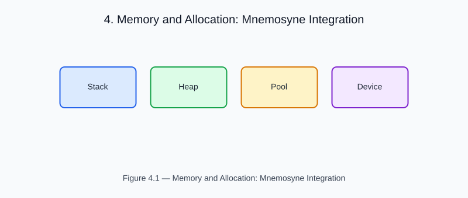

# Chapter 4 — Memory and Allocation: Mnemosyne Integration

<!-- generated-figure-start -->

*Figure 4.1 — Memory and Allocation: Mnemosyne Integration*
<!-- generated-figure-end -->

Helios allocates every dense physics array through the leto array substrate:
`Volume<T>` owns a C-contiguous `leto::Array3<T>` (`crates/helios-domain/src/volume.rs`),
and sinograms, dose grids, and terma volumes are built once and then read
through borrowed slices.

## Aligned Storage — `mnemosyne-arena` in the planning kernel

`helios-planning` consumes `mnemosyne-arena`'s `AlignedVec<T>` as the backing
store of the dense dose-influence matrix (`DoseInfluence::data` in
`crates/helios-planning/src/optimize.rs`). The buffer *start* is 64-byte
cache-line aligned; rows are packed without padding, so row `i` begins
`i · beamlets · size_of::<T>()` bytes past it and is itself line-aligned only
when `beamlets · size_of::<T>()` is a multiple of 64. Rows are not padded: the
optimizer's measured gain at 57 beamlets per row (misaligned rows) is at least
its gain at 64 (aligned rows), so row alignment is not its source. It is the
only structure that opts in;
every other dense array still goes through the leto array substrate described
above.

Arena-backed *placement* for the large intermediate buffers is still tracked
work, not current behaviour: `mnemosyne-core` is declared in the workspace
dependency SSOT (`Cargo.toml`) but no member consumes it. The placement
contract Helios does consume is Themis
(`PlacementHint`/`MemoryTier` in `crates/helios-gpu/src/{attenuation,projection,transmission}.rs`),
which hints GPU-resident buffers.

## Layout Policy

| Data | Layout | Rationale |
|---|---|---|
| Volumetric arrays | C-contiguous (row-major) | Cache-friendly 3D iteration |
| Sinogram | Row per angle | Independent-angle parallelism |
| Dose grid | C-contiguous | Same as CT for subtraction |
| Dose-influence matrix | Row-major, unpadded rows, 64-byte aligned buffer start | Row-wise kernels over one contiguous buffer |

## Zero-Copy Slicing

Volume::as_slice() returns a `&[T]` borrow from the underlying leto::Array3
without allocation. Kernels operate on borrowed slices, enabling zero-copy
pipelines from CT → μ → terma → dose.

## Further Reading

- [Scalar Fields and Numeric Abstractions](numerics.md)
- [mnemosyne crate](https://github.com/ryancinsight/Mnemosyne)
