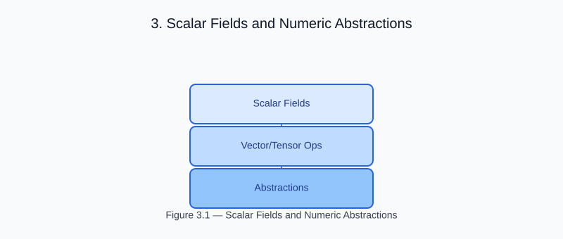

# Chapter 3 — Scalar Fields and Numeric Abstractions

<!-- generated-figure-start -->

*Figure 3.1 — Scalar Fields and Numeric Abstractions*
<!-- generated-figure-end -->

Helios uses `helios_math::Scalar`, a re-export of
`eunomia::RealField`, as its canonical real-number seam. The same generic
kernel can therefore be instantiated for each scalar type supported by Eunomia
without duplicating the algorithm.

## Scalar hierarchy

```text
eunomia::NumericElement
         ↓
eunomia::FloatElement
         ↓
eunomia::RealField
```

`helios-math` also re-exports `NumericElement`, `FloatElement`,
`CastFrom`, and `CastTo`; domain crates normally depend only on the
`Scalar` name.

## Generic kernel

```rust
use helios_math::Scalar;

fn square<T: Scalar>(value: T) -> T {
    value * value
}
```

The bound stays on the operation that requires field arithmetic. Storage types
such as `Volume<T>` do not introduce a second numeric trait.

## Atlas ownership

| Concern | Authoritative crate |
|---|---|
| Scalar traits and conversions | `eunomia` |
| Dense arrays and geometry | `leto` |
| Helios scalar vocabulary | `helios-math` |
| GPU execution | `hephaestus-core` / `hephaestus-wgpu` |

## Further reading

- [Physics Domain Types and Safety Boundaries](foundations.md)
- [Memory and Allocation](memory.md)
