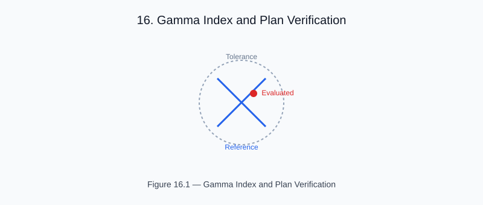

# Chapter 16 — Gamma Index and Plan Verification

<!-- generated-figure-start -->

*Figure 16.1 — Gamma Index and Plan Verification*
<!-- generated-figure-end -->

The gamma index is the standard plan QA metric for 3D dose comparison:

```text
γ(r_ref) = min_{r_eval} √[ (D_ref − D_eval)²/(δD)² + |r_ref − r_eval|²/(δr)² ]
```

A point passes if γ < 1.

```rust
use aequitas::systems::si::{
    quantities::{AbsorbedDose, Length},
    units::{Gray, Millimeter},
};
use helios_analysis::{gamma_index_3d, gamma_pass_rate};

let gamma = gamma_index_3d(
    &dose,        // evaluated distribution
    &reference,   // reference distribution
    0.03,         // ΔD tolerance (3 % of prescription)
    Length::from_unit::<Millimeter>(2.0),
    AbsorbedDose::from_unit::<Gray>(5.0),
    Length::from_unit::<Millimeter>(6.0),
)?;

let pass_rate = gamma_pass_rate(
    &gamma,
    &reference,
    AbsorbedDose::from_base(0.0),
);
println!("3%/2mm pass rate: {:.1}%", pass_rate * 100.0);
```

## Verifying the Metric

Comparing a dose distribution against *itself* yields γ = 0 everywhere and a
100% pass rate no matter what the dose engine computed, so it is a unit check on
the gamma kernel — not evidence about a plan.

The tomotherapy workflow therefore compares the dose against an independently
constructed field: the same distribution scaled uniformly by `s`. Writing
`peak = max D` and `c` for the dose-difference criterion, the closest candidate
to the hottest voxel is that voxel itself, so its gamma is exactly `(1 − s)/c`.
A 2%-low field (`s = 0.98`, inside a 3% criterion) must pass everywhere; a
6%-low field is the **negative control** and must not.

## Clinical Standard

AAPM TG-218 recommends 3%/2 mm criteria with 10% dose threshold.
Pass rate ≥ 95% is the typical clinical acceptance criterion.

## Further Reading

- [Example: Tomotherapy Workflow](examples/tomotherapy_workflow.md)
- [Dose-Volume Histograms](planning_dvh.md)
