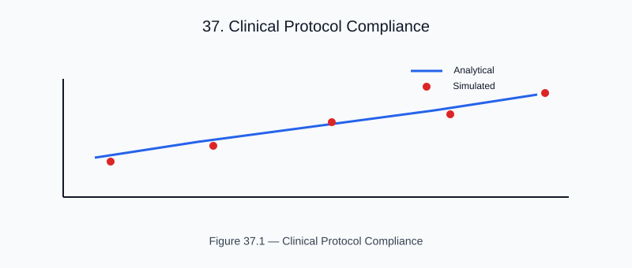

# Chapter 25 — Clinical Protocol Compliance

<!-- generated-figure-start -->

*Figure 37.1 — Clinical Protocol Compliance*
<!-- generated-figure-end -->

Helios is research and simulation software. It is not a validated clinical
device, and no regulatory or dosimetric-commissioning claim is made for it. The
benchmarks below are **targets**, not results: neither is implemented or
asserted anywhere in the repository. The evidence tier Helios currently holds
for dose is analytical oracles and cross-backend differential tests (see
[Analytical Solutions and Regression Tests](validation_regression.md)) - never
comparison against a measured beam, a reference Monte-Carlo engine, or a
published benchmark plan.

## TG-119 (IMRT Commissioning) - target, not implemented

AAPM TG-119 defines test cases for IMRT commissioning with known dose distributions:
- Simple C-shape, head-and-neck, prostate plans
- Expected point-dose accuracy: 3% / 3 mm gamma

Helios contains no TG-119 case, no machine or beam commissioning model, and no
leaf sequencing, so this benchmark cannot presently be run.

## TRS-398 Absorbed Dose Protocol - target, not implemented

IAEA TRS-398 calibration conditions (6 MV, 10x10 cm2 field, 10 cm depth in water):
- Reference dose rate: 1 cGy/MU at calibration geometry

Helios models no monitor-unit or absolute dose-rate calibration; its dose is
relative to an input energy fluence. Photon attenuation enters through the
Hyperion contract `MassAttenuation::new(AreaPerMass)` - there is no
`MassAttenuation::water()` constructor in the resolved provider graph - which is
a coefficient input, not a dosimetric calibration.

## TomoTherapy Workflow

The tomotherapy workflow example achieves:
- Water ROI μ reconstruction error: < 0.2% of μ_water
- DVH mean dose consistent with prescribed fluence
- 3%/2 mm gamma against a 2%-low comparison field: **100%** pass, with the
  6%-low negative control failing as required (see
  [Gamma Index and Plan Verification](planning_gamma.md))

A gamma of the dose against itself is not reported here: it is 100% by
construction and carries no information about the dose engine.

## Further Reading

- [Reference Phantoms](validation_phantoms.md)
- [Gamma Index and Plan Verification](planning_gamma.md)
