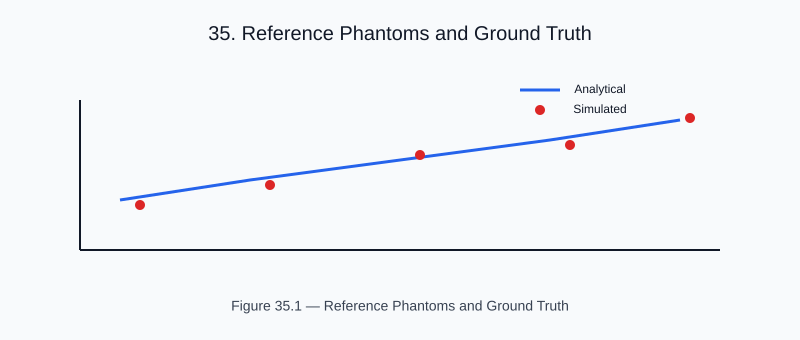

# Chapter 23 — Reference Phantoms and Ground Truth

<!-- generated-figure-start -->

*Figure 35.1 — Reference Phantoms and Ground Truth*
<!-- generated-figure-end -->

Helios includes synthetic test phantoms for validation and regression testing.

## Water Cylinder Phantom

The standard phantom for attenuation and dose validation:

```text
fn water_cylinder_phantom(nx: usize, spacing: f64) -> Volume<f64> {
    let c = (nx as f64 - 1.0) * spacing / 2.0;
    Volume::from_shape_fn(grid, move |idx| {
        let r = distance_from_axis(idx, c, spacing);
        if r <= 25.0 { 0.0 } else { -1000.0 }  // water cylinder in air
    })
}
```

## Bone Insert

A cortical bone insert (800 HU) within the water cylinder tests
heterogeneity correction in the collapsed-cone solver.

## Analytical Oracles

The oracles are written into the tests and examples that use them, not exposed
as a crate API:

- **Cylinder Radon oracle** — the exact chord `2*mu0*sqrt(r^2 - s^2)`, asserted
  by `disk_sinogram_matches_analytical_chord` in
  `crates/helios-imaging/src/radon.rs`, and end-to-end through FBP recovery in
  `crates/helios-imaging/src/fbp.rs` and
  `crates/helios-analysis/examples/validation_regression.rs`.
- **Percentage depth dose in water** — the analytical
  `PDD(d) = exp(-mu*(d - d0)) * ((SSD + d0)/(SSD + d))^2` law, asserted against
  the primary terma kernel in `crates/helios-solver/src/deposition.rs` with a
  tolerance derived from `T::EPSILON`.

`helios-analysis` itself exports the evaluation metrics (`Dvh`, `gamma_index_3d`,
ROI and image-quality statistics), not oracle generators.

## Further Reading

- [Example: Tomotherapy Workflow](examples/tomotherapy_workflow.md)
- [Analytical Solutions and Regression Tests](validation_regression.md)
