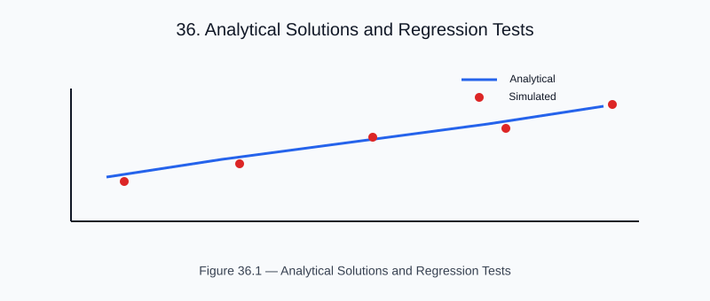

# Chapter 24 — Analytical Solutions and Regression Tests

<!-- generated-figure-start -->

*Figure 36.1 — Analytical Solutions and Regression Tests*
<!-- generated-figure-end -->

Every physics primitive in Helios has at least one analytical oracle test.

## Radon Transform Oracle

For a cylinder of radius 
 and uniform attenuation μ₀:

```text
R(t) = 2μ₀√(r² − t²)  for |t| < r, zero otherwise
```

This oracle is asserted in the `helios-imaging` unit tests
(`crates/helios-imaging/src/{radon,fbp}.rs`) and in the runnable
`helios-analysis` example `validation_regression`; `helios-imaging` has no
separate `tests/` directory.

## FBP Reconstruction Error

For the 61-voxel water phantom (r = 25 mm, μ_water = 0.060 cm⁻¹):

`
Reconstruction RMSE < 0.005 cm⁻¹ (< 10% of μ_water)
`

## Gamma Self-Consistency

A dose distribution compared against itself must yield 100% pass rate.
This is the cheapest sanity check for the gamma engine.

## Further Reading

- [Reference Phantoms](validation_phantoms.md)
- [Clinical Protocol Compliance](validation_clinical.md)
