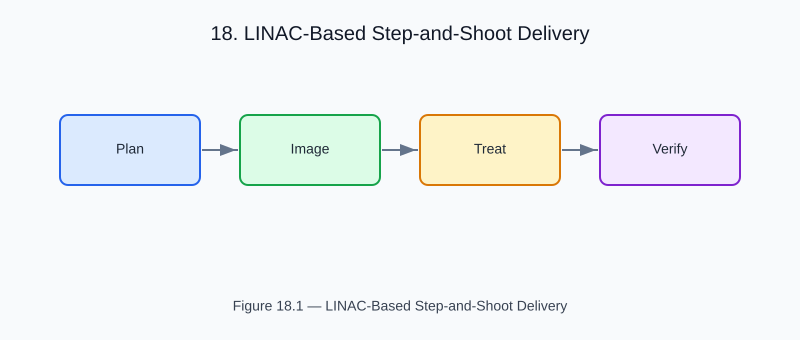

# Chapter 18 — LINAC-Based Step-and-Shoot Delivery

<!-- generated-figure-start -->

*Figure 18.1 — LINAC-Based Step-and-Shoot Delivery*
<!-- generated-figure-end -->

Linear accelerator (LINAC) IMRT delivers dose through a sequence of static
beam apertures (step-and-shoot) or dynamically moving MLC leaves (sliding window).

## Step-and-Shoot IMRT

Each segment has:
- A gantry angle
- An MLC aperture shape
- A monitor unit count

```rust
use helios_domain::StaticSegment;

let segment = StaticSegment {
    gantry_angle_deg: 90.0,
    mlc_positions: aperture,
    monitor_units: 45,
};
```

## Dose Calculation

Same collapsed-cone engine as TomoTherapy, applied field-by-field
and summed:

```rust
let total_dose = segments.iter()
    .map(|seg| calculate_segment_dose(seg, &mu))
    .fold(Volume::zeros(grid), |acc, d| acc + d);
```

## Further Reading

- [TomoTherapy End-to-End Workflow](workflow_tomotherapy.md)
- [Adaptive Radiotherapy with MVCT](workflow_adaptive.md)
